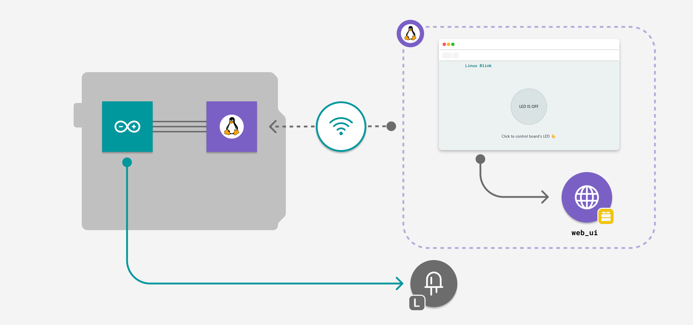
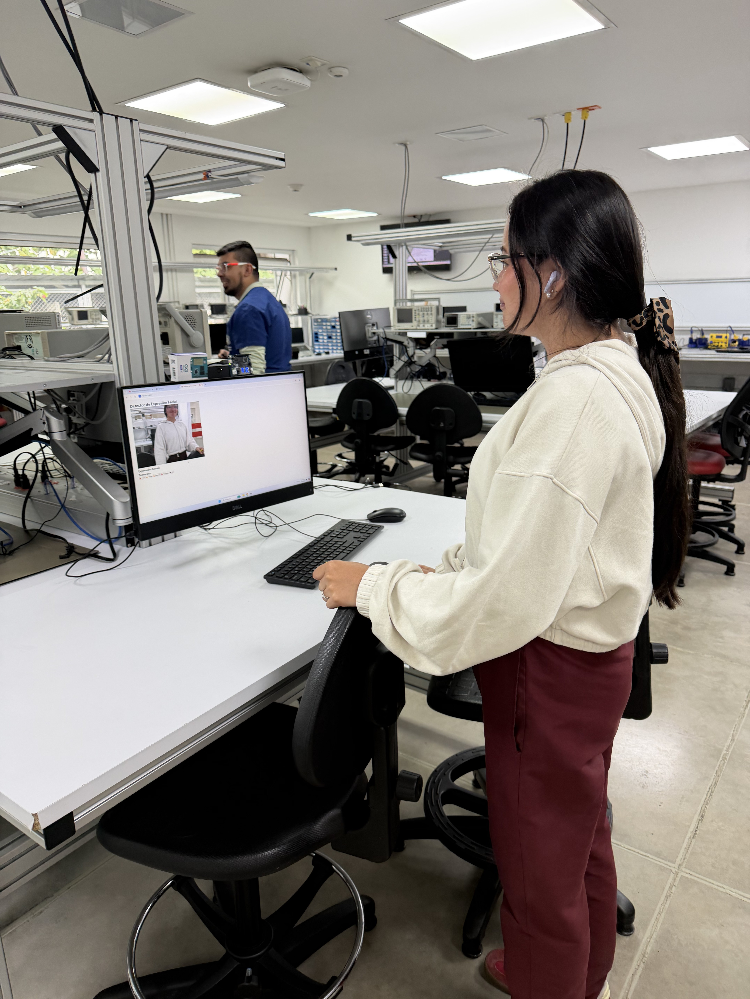
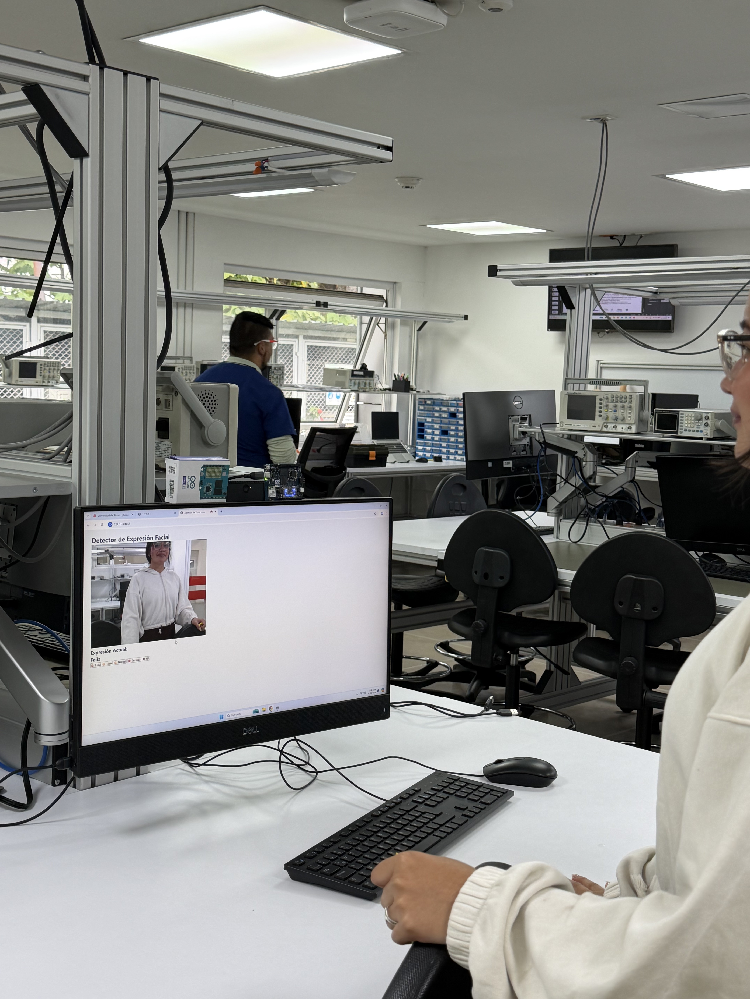
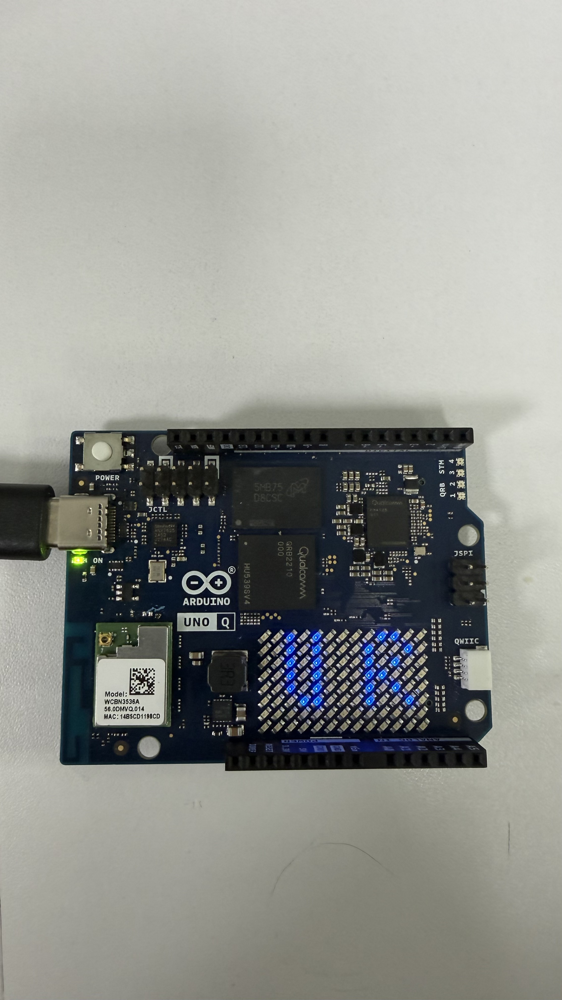

# Emotions-Arduino-Q: Edge Face Emotion Recognition 🎭

[](https://opensource.org/licenses/MIT)
[](https://www.arduino.cc/)
[](https://github.com/jsarmientor/emotions-arduino-q.git)

**Emotions-Arduino-Q** is a real-time face emotion recognition system running on the edge using **Arduino UNO Q**, **Python**, and **face-api.js**. This project bridges the gap between high-level browser-based AI and low-level hardware interaction.




## 📌 Overview

This application analyzes human facial expressions in real-time through a web browser and triggers physical responses on an Arduino board. It demonstrates how to implement Edge AI with a seamless communication bridge between a web frontend and a microcontroller.

## 📂 Project Structure

```text
emotions-arduino-q/

├── Code/               # Core source code
│   ├── arduino/        # Firmware for Arduino UNO Q (.ino)
│   ├── models/         # Pre-trained face-api.js models
│   ├── libs/           # WebSocket and UI libraries
│   ├── main.py         # Python Backend (Bridge & WebUI)
│   ├── app.yaml        # Configuration for App Lab
│   ├── index.html      # Web interface
│   └── script.js       # Face detection & emotion logic
├── images/             # Documentation assets
└── README.md           # Project documentation
```

## 🧠 Model Architecture

The system utilizes two specialized neural networks provided by `face-api.js`:

1.  **Tiny Face Detector**: A lightweight, real-time face detection model optimized for mobile and web browsers. It is faster than standard SSD Mobilenet V1 while maintaining high accuracy for close-range detection.
2.  **Face Expression Net**: A convolutional neural network (CNN) trained on thousands of facial expressions. It maps 68 facial landmarks to recognize 7 basic emotions: *Happy, Sad, Neutral, Angry, Surprised, Disgusted,* and *Fearful*.

## 🌟 Advantages

- **Edge Computing**: All AI processing happens locally in the browser. No video data is ever sent to the cloud, ensuring **total privacy**.
- **Low Latency**: By running on the edge, the system achieves near-instant response times for hardware control.
- **Cross-Platform**: The web interface works on any modern browser, making it accessible from desktops, tablets, or even the Arduino UNO Q in standalone mode.
- **Easy Integration**: Uses the **Arduino Router Bridge** to call hardware functions directly from high-level JavaScript/Python.

## 🛠️ Hardware Requirements

- **Arduino UNO Q**
- **USB-C® cable**
- **USB-C® hub** (optional, for standalone use)

## 🚀 How to Use

1.  **Flash**: Upload the code in `Code/arduino/` to your board.
2.  **Run**: Launch the project via **Arduino App Lab**.
3.  **Interact**: Open the UI at `<UNO-Q-IP-ADDRESS>:7000`. The camera will start automatically.


## 🎥 Visual Gallery

### 🤖 Project in Action
These images demonstrate the real-time interaction between facial expressions and the Arduino LED matrix.

| **Face Tracking** | **Hardware Response** | **Inference Result** |
| :---: | :---: | :---: |
|  |  |  |

> [!TIP]
> **Watch the Main Demo**: [🎬 Emotions-Arduino-Q in Action (Video)](images/IMG_5832.MOV)

## 📸 Project Media


You can find more project media (images) in the [images/](images/) directory.

```text
- Images: JPG format (Previews)
```


## 📝 License


This project is licensed under the MIT License.
